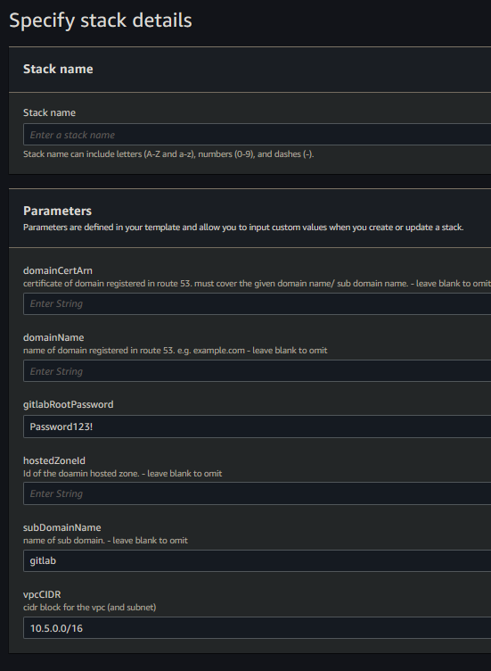

# EC2-Gitlab-Instance

---

# Instance:
 - ImageId: ami-084e8c05825742534 (eu-west-2)
 - InstanceType: t2.medium

---

## Setup:
1. deploy the template to cloudformation
2. enter the parameters

3. configuration with a domain:
   1. including the `hostedZoneId`, `domainName`, `subDomainName` & `domainCertArn` parameters will:
      1. Create a HTTPS loadbalancer targetGroup & listener with the `domainCertArn` on port 443
      2. Create a dns record in the `hostedZoneId` for `subDomainName.domainName` e.g. `gitlab.example.co.uk`
      3. Configure the gitlab instance for the domain `subDomainName.domainName`
   2. not including the `hostedZoneId`, `domainName`, `subDomainName` & `domainCertArn` parameters will:
      1. Omit the HTTPS loadbalancer targetGroup & listener
      2. Not create any dns records
      3. Configure the gitlab instance to be accessible from the loadbalancer e.g. `{loadBalancerName}-1234567890.AWS::Region.elb.amazonaws.com`
4. Give time for the instance to create, it will be accessible from the dns record or the public ELB domain

# Notes
Q: Why is a load balancer needed?
A: The Gitlab CE installation creates & signs its own HTTPS certificate which some browsers warn about when trying to access the site. The load balancer allows port 443 to be listened on & inject your domain certificate when using HTTPS to resolve this issue.

Q: How do backups work?
A: The gitlab.rb file is configured to send the `Gitlab backup`, the `gitlab.rb` file & `gitlab-secrets.json`. A backup will occur everyday at 00:00. A backup can also be preform by running the preform-backup SSM document.

The default username is `root` & the userData script sets the password to `gitlabRootPassword` stack parameter, The default being `Password123!`

---

# Self-Managed Gitlab CE
Once you finish setting up Gitlab CE you can login, create groups & repos without issue. You can even clone them locally (setup ssh), add files then push them back to your Gitlab. Additionally, You can also register your own runners on a global or group level [check this out](https://github.com/mattyboy84/AWS-EC2-Gitlab-runner-fleet). These runners can then create resources in aws using a template.yaml & gitlab-ci.yaml.
