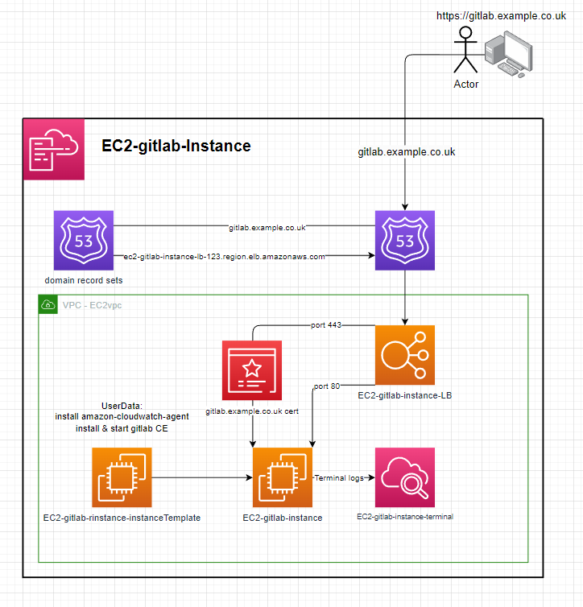

# EC2-Gitlab-Instance

---

# Instance:
 - ImageId: ami-084e8c05825742534 (eu-west-2)
 - InstanceType: t2.medium

---

# Setup with domain:
1. prepare a domain / sub-domain e.g. 'gitlab.example.com'
2. register a certificate that includes the prepared domain
3. deploy the template with the given parameters.
4. give about 10 mins for deployment and for gitlab CE to install & configure
5. create a record in the 'example.com' hosted zone for 'gitlab.example.com' to route to the application load balancer.
6. wait for record to propagate then visit 'gitlab.example.com'

7. The default username is `root` & the script sets the password to `Password123!`

---

# Setup without domain:
1. All resources, parameters & outputs referring to `domain`, `HTTPS` & `port 443` can be removed. This includes:
   1. Parameters
      1. domainName
      2. domainCertArn
   2. Resources
      1. HTTPSlistener
      2. HTTPStargetGroup
   3. Outputs
      1. gitlabUrl
2. remove the `'WITH DOMAIN'` part of the userData script (at the end) and uncomment the `WITHOUT DOMAIN` part of the script.

---

# Notes
Q: Why is a load balancer needed?
A: The Gitlab CE installation creates & signs its own HTTPS certificate which some browsers warn about when trying to access the site. The load balancer allows port 443 to be listened on & inject your domain certificate when using HTTPS to resolve this issue.

Q: How do backups work?
A: The gitlab.rb file is configured to send the `Gitlab backup`, the `gitlab.rb` file & `gitlab-secrets.json`. A backup will occur everyday at 00:00. A backup can also be preform by running the preform-backup SSM document.

---

# Self-Managed Gitlab CE
Once you finish setting up Gitlab CE you can login, create groups & repos without issue. You can even clone them locally (setup ssh), add files then push them back to your Gitlab. Additionally, You can also register your own runners on a global or group level [check this out](https://github.com/mattyboy84/AWS-EC2-Gitlab-runner-fleet). These runners can then create resources in aws using a template.yaml & gitlab-ci.yaml.
